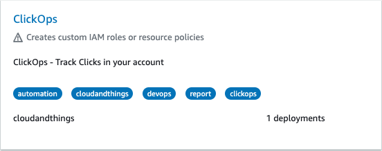
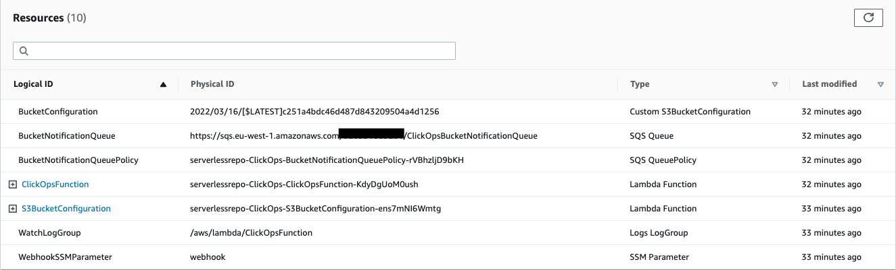
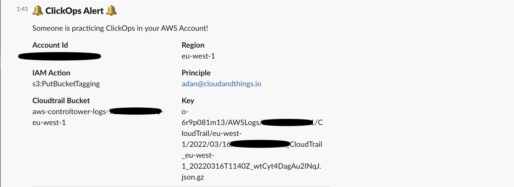

# serverless-aws-clickops-notifier

Get notified when users are taking actions in the AWS Console. More can be found [here](https://medium.com/cloudandthings/aws-clickoops-1b8cabc9b8e3) but only this is our AWS Serverless App which is now available for general use.
## 🏗️ Serverless App Usage
### Requirements

It is not strictly a requirement, that you use this with AWS ControlTower. The module has only been tested in the Log Archive account that ships with AWS ControTower. 

### Inputs

| Name | Description | Type | Default | Required |
|------|-------------|------|---------|:--------:|
| CloudtrailBucket | Bucket containing the Cloudtrail logs that you want to process. ControlTower bucket name follows this naming convention `aws-controltower-logs-{{account_id}}-{{region}}` | `string` | n/a | yes |
| WebhookUrl | The webhook URL for notifications. https://api.slack.com/messaging/webhooks | `string` | n/a | yes |
| MessageFormat | Where do you want to send this message? Only slack, for now. | `string` | `"slack"` | no |
| ExcludedAccounts| List of accounts that be excluded for scans on manual actions. These take precidence over `included_accounts` Should be a valid json string example: `["123456789012", "..."]` | `string` | `[]` | no |
| IncludedAccounts | List of accounts that be scanned to manual actions. If empty will scan all accounts. Should be a valid json string example: `["123456789012", "..."]` | `string` | `[]` | no |
| ExcludedUsers | List of email addresses will not be reported on when practicing ClickOps.  Should be a valid json string example: `["user@example.com", "..."]` | `string` | `[]` | no |
| IncludedUsers| List of emails that be scanned to manual actions. If empty will scan all emails. Should be a valid json string example: `["user@example.com", "..."]` | `list(string)` | `[]` | no |
| EventProcessingTimeout | Maximum number of seconds the lambda is allowed to run and number of seconds events should be hidden in SQS after being picked up my Lambda. | `Number` | `60` | no |
| LogRetention | Number of days to keep CloudWatch logs | `Number` | `30` | no |

----
## 🚙 Test Drive

Head to the AWS Console and go Serverless Application Repository. Search for Clickops in the Public Applications. Select the ClickOps application and complete the Application Settings. 

The Serverless App will deploy the following resources below:

- `Custom S3BucketConfiguration` and `Lambda Function`: The custom configuration invokes a lambda with parameters needed to create a bucket notification policy which the ClicksOps lambda filters through to determine the events associated with resources being modified in the console
- `SQS Queue`	and `SQS QueuePolicy`: The bucket notification places those events on an SQS queue which the ClickOps Lambda consumes
- `Lambda Function`: The ClickOps Lambda
- `Logs LogGroup`: The ClickOps Lambda Log Group
- `SSM Parameter`: The SSM parameter used to store the Slack WebHook URL

Once the Application is deployed tune into the Slack Channel you set to notify and marvel in watching those non-IAAC gremlins make changes in the Console.

